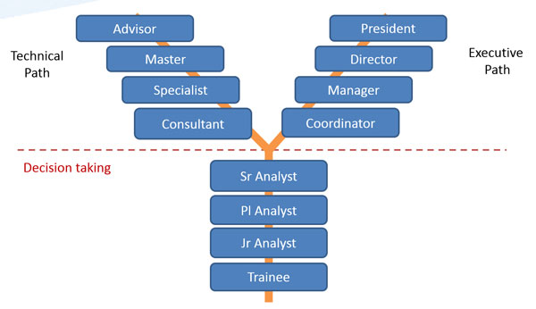

# Carreira em Y

A carreira Y é a forma de continuar com o plano de carreira e desenvolvimento de pessoas em carreira técnica.

Para termos uma carreira y eficiente precisamos de um mecanismo de avaliação para diferenciar claramente os níveis de maturidade de um indivíduo. Para isso temos a cultura de Feedbacks

## Cultura de FeedBacks

Feedback é um meio de transmitir a nossa percepção sobre uma pessoa de forma construtiva e com o objetivo de desenvolver quem a recebe.

Geralmente os feedbacks são aplicados pelos gestarores sobre os liderados mas acreditamos que #tamojunto, então, a verdadeira cultura de feedback permite que as pessoas independente de área e nível hierarquivo possa dar um feedback, já que o intítuo é sempre desenvolver a pessoa.

Já deu seu feedback hoje ?

## Avaliação 360

Ocorre em períodos tri-mestrais, são avaliações 360 grau, onde todas as pessoas do time possam avaliar a pessoa e a si mesmo dentro dos pilares que acreditamos ser fundamental para a evolução de carreira/promoção dentro da OLX.

Essas avaliações devem sempre vir com exemplos e fatos para que os feedbacks gerado possam ser utilizado para o desenvolvimento e oportunidades para o crescimento no plano de carreira.

Avaliamos 3 pilares.

### Pilar 1: Conhecimento técnico

Neste pilar, é avaliado a percepção do time em relação ao nível técnico da pessoa.

### Pilar 2: Faz acontecer

Neste pilar, é avaliado a percepção do time em relação ao quanto essa pessoa é engajada em vencer os obstáculos e a velocidade de entrega das demandas.

### Pilar 3: Impacto

Neste pilar, é avaliado o grau de impacto que essa pessoa gera no time, no produto, na empresa.
